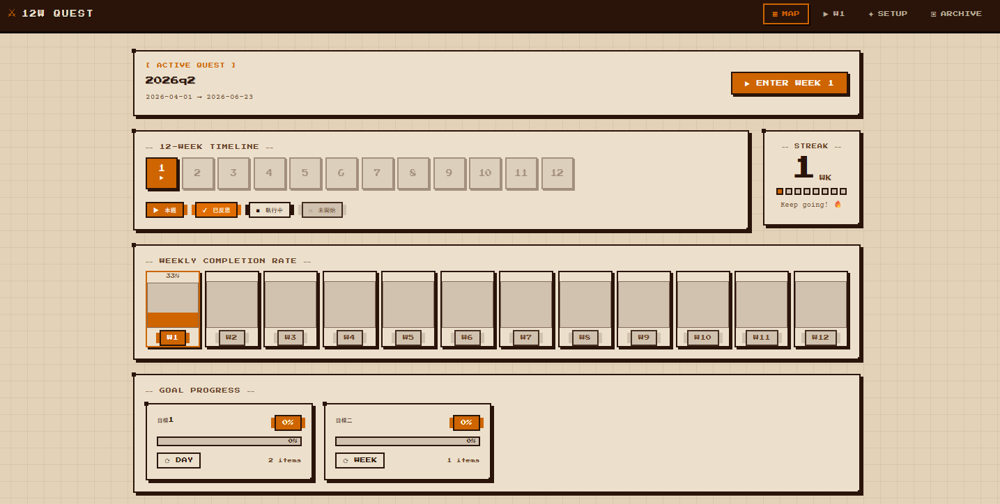

# 2026 Q1 12週計劃線下分享會

> 主講人：美墨碗

### Q1 12週執行狀況

本季平均達成率：85.05%

<figure><figcaption></figcaption></figure>

> 結論：穩定成長，大慨吧

### 里程碑達成狀況

#### 目標一：新鳥生存計劃 99%

順利活過了三個月，目前除了灌甲方、灌 PM 其他都很 OK，下季可以開始執行離職清單計劃

本季覺得這個新鳥計劃蠻不錯的，每週會回顧自己有沒有在公司成長 (不管是心理面的還是技術面的)

雖然中間 w11 的時候想要調整紀錄方式然後發現效果不好，所以新鳥筆記直接寫不出來…最後還是回歸寫 log 的方式

下一季會再啟菜貓計劃 - 思考：想成為什麼樣的前端工程師

#### 目標二：每月看一本書 33.333%

最後只達成深度工作力，不過成效蠻好的，大家好像蠻喜歡看墨水說 XDD

後面就是都在亂看一些小廢書，快樂

也入了推薦的極限返航實體書，實體書真的無法被取代哎

最後下一季預計啟動：墨水說納瓦爾

#### 目標三：運動 99%

原本是要加上重訓，但真的很難哎…不過未來應該還是要面對的啦…

不過每日都可以平穩的走到 12,000 步左右，加上如果上班壓力比較大的話，我就會再多走兩站捷運回去，記得第一個月的時候我跟後端溝通困難就邊走邊氣邊跟大文哥訊息，在這裡要非常感謝大文哥的心理舒壓時間

下一季會繼續保持每日 12,000 步，但重訓吼…我糾結一下啦

#### 目標四：邵同學督促計劃 60%

一開始成效不錯，可能大家動力都滿滿的XD

但我覺得投履歷吼，真的是讓人很心累的事…我 9 個月畢業後也是不停的在逃避與面對中反覆拉扯，所以我很理解現在邵仔的心路歷程與壓力，只能說：我們都在!!你有需要就用，你累了也可以直接跟我們說：哎，先不要管我，我需要自閉一下

只要記得走出來，我們都在!

下一季：哎？你要繼續督嗎xd? 請私訊

### 計畫之外

* 買了矽谷叔叔開啟了 skill 之旅
* 參加了 cake build with AI 試用了龍哥的 spectra 來開發專案，好玩唷
* 考慮好久還是入了最強個體
* 買了幾本小廢書看
* 看了 AI 時代的 Side Project 給了一些其他的思考 (但還沒看完
* 寫了長文給輪輪，但其實反而激勵了自己 😝
* 另外想要推『聰明表達，安靜也有影響力: 內向者必讀的職場發光指南』給你們這群 I 人

### 最後

下一季我還是會繼續自己的 12 週計劃，因為 12 週帶給我的幫助非常的大

<figure><figcaption>
正在開發中的 12 週筆記本 (對，因為 gitbook 太難用了)
</figcaption></figure>
