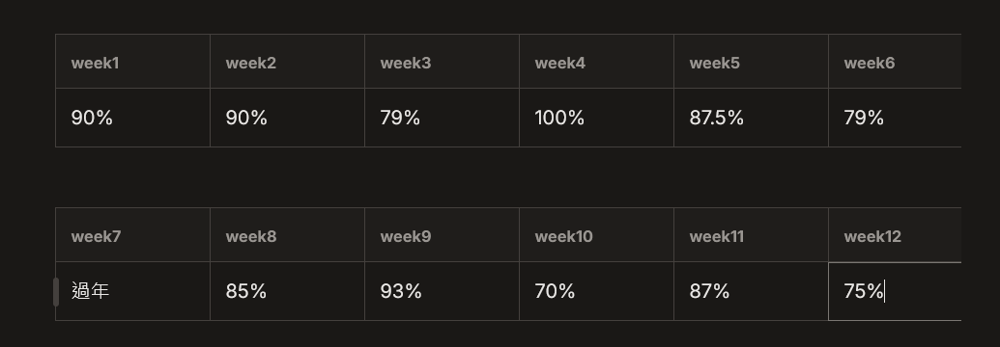

# 深度工作力

<figure><figcaption></figcaption></figure>

`w1`

## 前言

榮格、馬克．吐溫、J.K.羅琳，或利用沉思週寫出<網際網路的浪潮>一書的比爾．蓋茲，都在使用自己的深度工作力

比爾．蓋茲一年兩次的『沉思週』，在沉思週期間他會離群索居，住在一間木屋，只沉思大事情。

有影響力的人都在使用深度工作，而現代知識工作者反而離深度工作愈來愈遠，為什麼呢？---網路工具，網路工具把現代人的注意力切成片片斷斷的，一般知識工作者花超過 60% 的工作時間在回訊息( Email) 及網路搜尋上

> 深度工作?淺薄工作？

### 淺薄工作

不需要高度判斷、重覆性的工作，很容易在注意力分散的狀態中執行，這類工作通常無法創造多少價值，並且很容易模仿與取代。(隨時在發送 / 回覆訊息、信件，注意力頻繁被打斷，以便快速回應)

而可怕的是，如果經常處在慌亂的淺薄工作狀態，將會永久減損你深度工作的能力 (專注力)

裡面有一段關於班恩的故事讓我深有所感：

班恩是一位理財顧問，一間銀行僱用他來為複雜交易的銀行業者製作報表，當他發現使用巨集可以將六小時的手動操作，直接縮短不到一個小時後，\
他發現他的主要職業技能可以被巨集操作並且自己在這個體系中沒有多少價值，開始對於自己職涯的雄心壯志感到憂心忡忡

> 我之前工作是會計助理，特別是我很會使用 excel 及巨集，我總是會試著把重覆的工作自動化，所以別人一個禮拜的工作量我一天就可以處理的非常完美，然後就可以去做更多事情(摸魚)
>
> 後來也因為看到主管每次開會前都在那邊製作圖表苦手，就幫他串了 Google Looker (數據視覺化工具)
>
> <figure><figcaption>
示意圖，非公司報表
</figcaption></figure>
>
>因此我升級成了行政專員，並且薪水也升級到了行政天花板，也讓愛手工的同事們感覺到了自己的職涯危機 (我現在想想他們一定超討厭我的)，最後我重新開始思考了我的職涯方向...

說回班恩的故事，班恩後來決定辭掉理財公司的工作，轉職為程式設計師，但他遇到了一些問題...

他沒．辦．法 專注!!!!!\
學習電腦程式設計這種複雜的技術，需要心無旁鶩的專注!!

「我隨時會上網，檢查我的電子郵件。我控制不了我自己，這是一種強迫症！」班恩描述他辭掉工作前時期的狀態。

班恩很清楚知道自己無法深度工作，於是他把自己關在沒有電腦的房間，只有教科書、記事卡和螢光筆，一開始沒有訊息打擾的時期讓他很難熬；一個月後，他漸漸可以專心，最後達到每天能在房間待上超過五個小時無世隔絕的時間

「在我學完後，我讀了大約 18 本該主題的書」他回憶說

## 慨念

### 深度工作力，創造價值的關鍵能力

這本書出版是在 2021 年，當時雖然 GPT-3 才要普及，但已經可以看出 AI 對於人類工作的影響，書中有提到兩位經濟學家，他們說到未來會有三種群體的人變得非常稀缺：
- 高技術工作者：有能力跟智慧機器合作，並創造價值的人
- 超級明星：遠距讓人才打破地域限制，你的競爭對手變成了全世界的人，因此你必須要成為自己領域中的超級明星，才能在競爭中脫穎而出
- 擁有者：有強大資本的人

#### 成為新經濟市場中的贏家
而作者認為你要成為高技術工作者、超級明星有兩個核心特質：
1. 快速精通專業技術的學習能力
2. 品質與速度上達到高水準的生產能力

> 看到這裡的時候我深深的覺得，這個不就是現在的職場狀態嗎!!

而要達到這兩個核心特質，就需要深度工作力。

#### 快速精通專業技術的學習能力
想要快速學習一樣專業知識，你必須要高度專注而不分心。如果你能自如的深度工作，就能精通愈來愈複雜的系統與技術。反之，如果你仍和多數人一樣難以專注、容易分心，就不能期待自己能快速學會這些技術。

#### 高水準的生產能力
作者在訪問了幾所大學成績最優秀的大學學生後，發現他們用功的時間往往比一般成績的學生少。傑出的學生了解專注力在生產力中扮演的角色，他們懂得把專注力最大化，因此能減少準備測驗與撰寫論文的時間，但不會降低成績或論文的品質。

不僅是大學生的成績，職場上常見開始一項專案後，又必須轉換到另一項專案，但注意力很難立即跟著轉換，你的注意力還會留在原本的專案，這種狀況稱為『注意力殘留』，這種狀況下你很難達到高水準的生產能力。特別是注意力殘留越嚴重，表現就越差。\
注意力殘留的問題更體現了深度工作的重要性，當你想要達到高水準的生產力，你就必須長時間全神貫注在單一工作，不受干擾而分心。

另外作者也提到，主管跟老闆不在這個討論範圍內，因為他們的工作本身就具備必須分心的特殊性。\
所以除非有強烈證據顯示一心多用對你的職業很重要，否則培養深度工作的能力，才能為你帶來最高的價值。

`w2`

### 當深度愈稀有，就越值得你投入

*

### 深度工作力，美好生活的必要條件

`w3`

## 原則

### 培養深度工作力

*

### 學會擁抱無聊

*

***

`w4`

### 拒絕任何好處心態

*

### 排除淺薄事務

*
